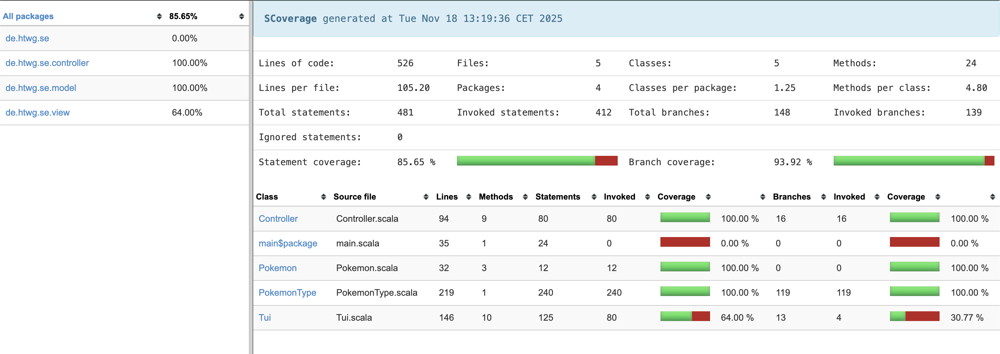

# Pokémon

[](https://github.com/CARLOKO98/Pokemon/actions/workflows/scala.yml)
[](https://coveralls.io/github/CARLOKO98/Pokemon?branch=main)

Ein scala-basiertes Pokémon-Spiel...
## Features
- Vollständiges **MVC-Pattern**
- **Immutable Model** (`Pokemon.withHp`)
- **Komplette Typ-Effektivitäts-Matrix** (Gen 9)
- **TUI** mit HP-Balken, Rahmen, dynamischem Menü
- **Observer-Pattern** (Controller → TUI)
- **100 % Testabdeckung** (Scoverage)

## Tests
- `PokemonSpec`: Immutabilität, HP-Clamping
- `PokemonTypeSpec`: Alle 324 Typ-Kombinationen
- `ControllerImplSpec`: Angriff, Flucht, Sieg/Niederlage
- `TuiSpec`: Rendering, HP-Balken

## Coverage


## Ausführung
```bash
sbt run